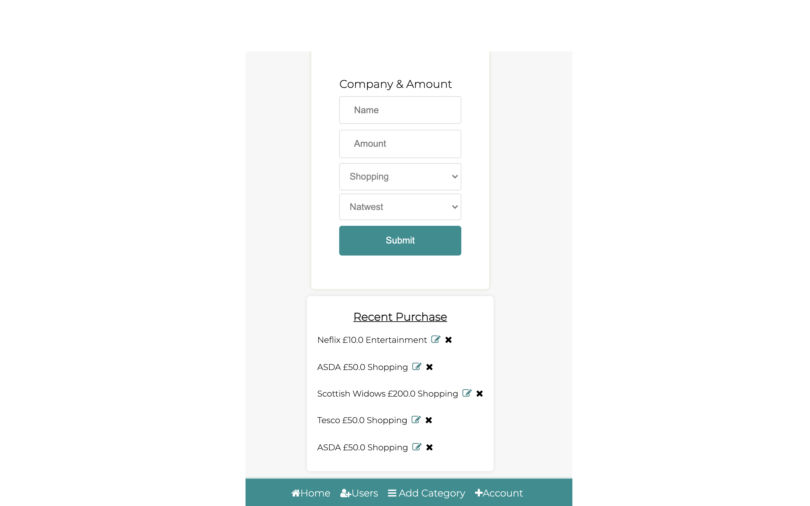

# Project Brief

Spending tracker. Create something that allows the you to add yourself as a user. 
Add a bank account. 
Add the amount you have spent and where you spend it.

MVP

- The app will allow you do create and edit companies
- Create/add or edit categorys
- Assign the companies with the appropriate category
- Display spending infomation

Extensions

- When you add the amount that you have spent this will get deducted from the users account. 
- Allow the user to select what account the money came out from. 

What this app uses
- flask
- python
- HTML
- Jinja2
- CSS
- 

