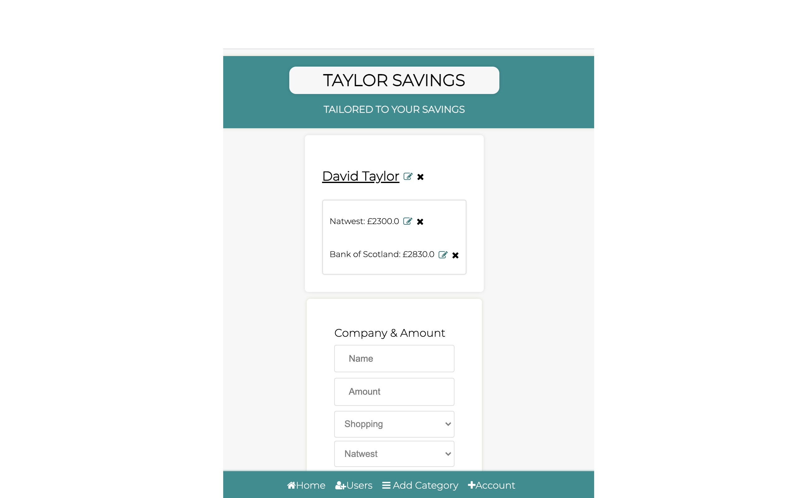

# Project Brief

Spending tracker. Create something that allows the you to add yourself as a user and the accounts that you may have. 
Then add the spending that you have done that day.

MVP

- The app will allow you do creat and edit companys
- Create and edit categorys
- Assign the company with the appropriate category. 
- All this will then be displayed 

Extensions

- when you add the amount that you have spent this will get deducted from the users account. 
- Allow the user to select what account the money came out from. 

What this app uses
- flask
- python
- HTML
- CSS
 

